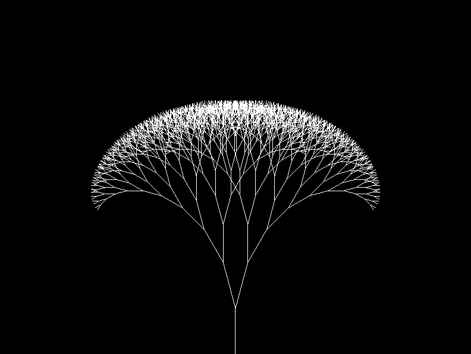

# Fractal Tree in C++

Easy implementation fractal tree in cpp with sfml



## Dependencies

Should be available on any OS.

- [SFML]
- [OpenGL]

## Quick Start

```
$ g++ main.cpp -lGL -lsfml-graphics -lsfml-window -lsfml-system -o tree

$ ./tree
```

## References

[SFML]: https://www.sfml-dev.org/
